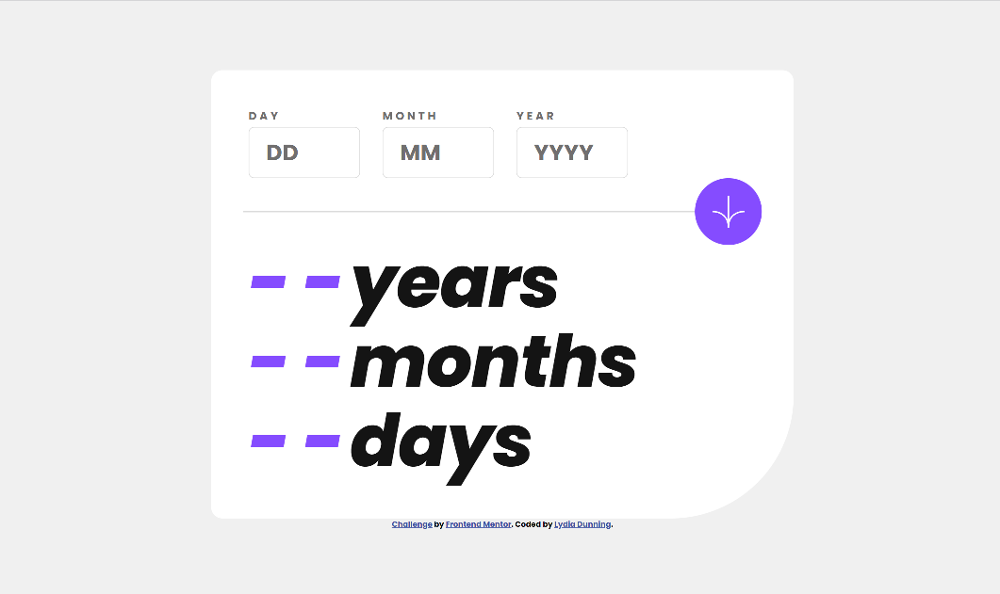
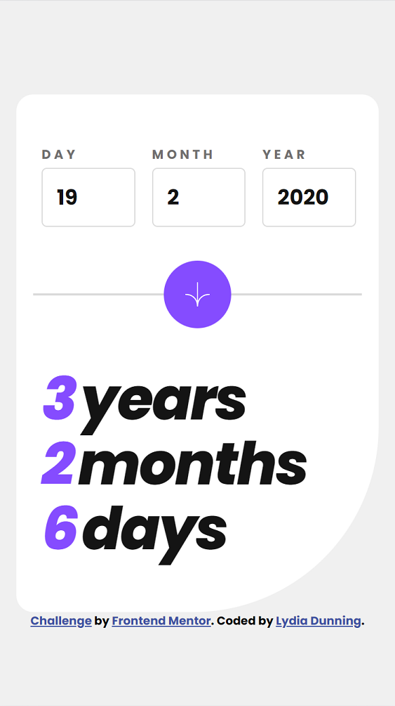

# Frontend Mentor - Age calculator app solution

This is a solution to the [Age calculator app challenge on Frontend Mentor](https://www.frontendmentor.io/challenges/age-calculator-app-dF9DFFpj-Q). Frontend Mentor challenges help you improve your coding skills by building realistic projects. 

## Table of contents

- [Overview](#overview)
  - [The challenge](#the-challenge)
  - [Screenshot](#screenshot)
  - [Take a Look](#take-a-look)
  - [Built with](#built-with)
- [Skills](#skills)
  - [Using State in React](#using-state-in-react)
  - [Javascript Promises](#javascript-promises)
- [Continued development](#continued-development)
- [Resources used](#resources)
- [Author](#author)

## Overview

### The challenge

Users should be able to:

- View an age in years, months, and days after submitting a valid date through the form
- Receive validation errors if:
  - Any field is empty when the form is submitted
  - The day number is not between 1-31
  - The month number is not between 1-12
  - The year is in the future
  - The date is invalid e.g. 31/04/1991 (there are 30 days in April)
- View the optimal layout for the interface depending on their device's screen size
- See hover and focus states for all interactive elements on the page
- **Bonus**: See the age numbers animate to their final number when the form is submitted

### Screenshot




### Take a Look

- Solution URL: (https://www.frontendmentor.io/solutions/age-calculator-built-with-react-NshBM-iHoM)
- Live Site URL: (lydiadunning.github.io/age_calculator)

### Built with

- [React](https://reactjs.org/) - JS web interface library
- [date-fns](https://date-fns.org/docs/) - JS date utility library
- [vite](https://vitejs.dev) - frontend tooling to initialize apps, serve files for development, and package builds.

## Skills

### Using state in React
#### What
I've reinforced my React skills by building a few static sites with minimal state, and this project gave me a chance to do more with state variables and state changes.
I set each state variable to an object, which was a new challenge for me.

#### Why
- Use of state is baked in to how React operates.
- Changing state triggers a re-render in React, which changes the page to reflect the current state.
- Setting state variables to objects requires more technical finesse than my previous projects without getting unweildy.

#### How 
I used three state variables, all initialized to the same value.
```jsx
  const initialObject = {
    day: '',
    month: '',
    year: '',
  }

  const [form, setForm] = useState(initialObject)
  const [output, setOutput] = useState(initialObject)
  const [errors, setErrors] = useState(initialObject)
```
This simplifies the declaration of each state, and these values can be easily reinitialized at any time.
These objects take in form input, dictate output, and feed error messaging to each input field respectively.


### Javascript Promises
#### What
Promises achieve asynchronous behavior in Javascript, I used them here for data validation.

#### Why
- I haven't worked with promises in a couple of years, and wanted to revisit the concept.
- Input validation and error messaging are legitimate use-cases for promises in React.  If I had used a library, like Yup, I wouldn't have needed to write these.
#### How 
The clickHandler uses promises to execute interactions.
```jsx
  const clickHandler = (event) => {
    formValidator(form)                               // Are forms filled out correctly?
      .then(() => calculateAge(form))                 // Calculate the age, or reject.
      .then((ageOutput) => {
        setOutput(ageOutput)                          // Set output to value returned by calculateAge
        setErrors(initialObject)                       // Reset errors to blank
      })      
      .catch(error => {
        setOutput(initialObject)                       // Reset output to blank
        setErrors(error)                              // Set errors to relevant error messages.
      })
  }
```
Both formValidator and calculateAge return promises. This code steps through the process of validating form input, calculating and then setting the output state. If an error occurs anywhere in the process, it's caught in the .catch, the output state is re-initialized, and the error state is re-written to reflect the errors returned when the relevant promise was rejected.
I'm quite satisfied with this code. It handles all changes to both output and errors.

The promises themselves, returned by formValidator and calculateAge, are constructed differently from each other.
FormValidator returns a Promise explicitly:
```jsx
  return new Promise((resolve, reject) => {
    if (noErrors) {
      resolve();
    } else {
      reject(allErrors)
    }
  });
```
Since formValidator serves as a gate to prevent age from being calculated if the data inputs aren't going to work, it was easy to return a simple Promise here. It doesn't even return a value if it's resolved.

In calculateAge, which runs calculations depending on various criteria, declaring a new Promise would mean cluttering it up with if else statements and calculations. Using the Promise.resolve and Promise.reject static methods avoided this problem.
```jsx
  return Promise.resolve({
    day: difference.days.toString(),
    month: difference.months.toString(),
    year: difference.years.toString()
  });
// ... if else statements
  return Promise.reject({
    day: 'Date must be in the past',
    month: ' ',
    year: ' '
  })
```
Returning Promise.resolve and Promise.reject avoids a huge clunky Promise and streamlines the code. Depending on the data evaluated by calculateAge, it can return different values when a promise is rejected, from different locations in the code.


### Continued development

I feel like I had a little breakthrough around sizing in css while working on this project. I found myself sizing elements in a way that felt fluid and natural, and transitioned well between different screen dimensions.
Prior to this project, working out the dimensions of various elements felt really fiddly. (I found formatting the default output text, the two purple lines, quite fiddly, but it fell into place when I added a space.)
Part of the shift was, I think, using min(), max(), and clamp() to set sizes that changed based on screen dimensions.

I incorporated an animation but it wasn't anything special. Given another opportunity, I'd like to see what animation libraries are available, and what they can do.

### Resources

This [article about react project structure](https://scrimba.com/articles/react-project-structure/) on scrimba helped me think about how to divide my code into separate files.

## Author

- Website - [Lydia Dunning](https://lydiadunning.github.io/Portfolio/)
- Frontend Mentor - [@lydiadunning](https://www.frontendmentor.io/profile/lydiadunning)

